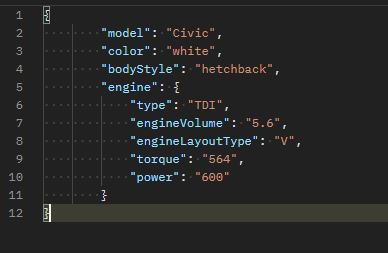

## :car: Database of cars 

    This Spring Boot application is simple example of working Web Application on Spring Framework.
    It represents a simple API to work with PostgreSQL database that storage information about cars.

---

### :robot: Technologies used in the application: 

    Spring Boot, Spring Data, Hibernate, PostgreSQL

    As client - Postman
    
    For documentation - Swagger

---
### 	:computer: How to start application?

1. Make a fork from this project or clone repository.

2. Build this application using Maven. 

    
>mvn clean install

3. Make sure your PostgreSQL database is running and db 'machines' is created!
4. Run .jar file.

    
>java -jar spring-boot-example.jar

or run it from IntellijIDEA

----

### When application started

#### Our request collection in Postman. :books:

There are GET, POST, PUT and PATCH requests.

Import requests collection using link
>https://www.getpostman.com/collections/37231fe0c58d2456d9f5

1. In Postman click on Import button.

2. Paste link in box and click Continue

3. Collection is ready!

## A quick instruction to save entities :floppy_disk:
1. Add Address
2. Add Dealer, Manufacturer or Service Station on existing Address
3. Add Car
4. You rock :sunglasses:

#### Example of saving entity to database
Request body:

Response: 

