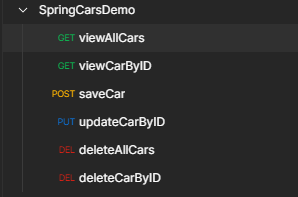
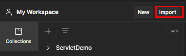
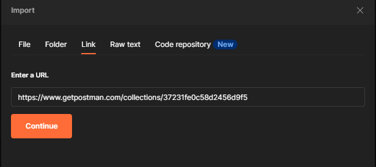
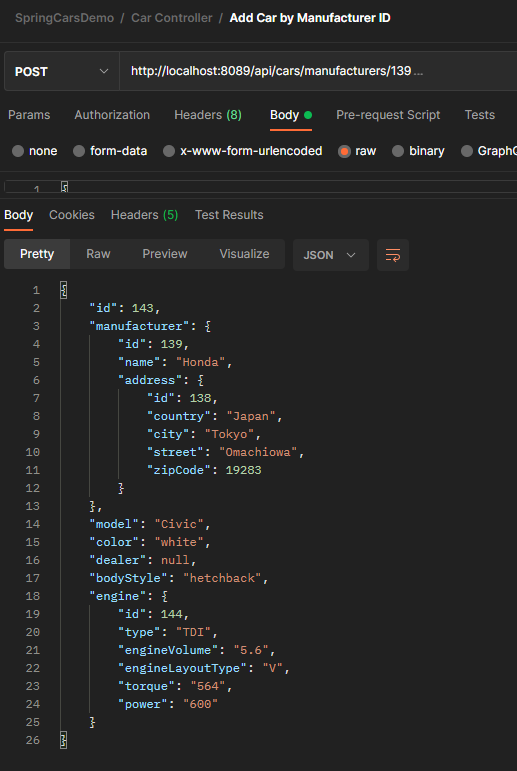
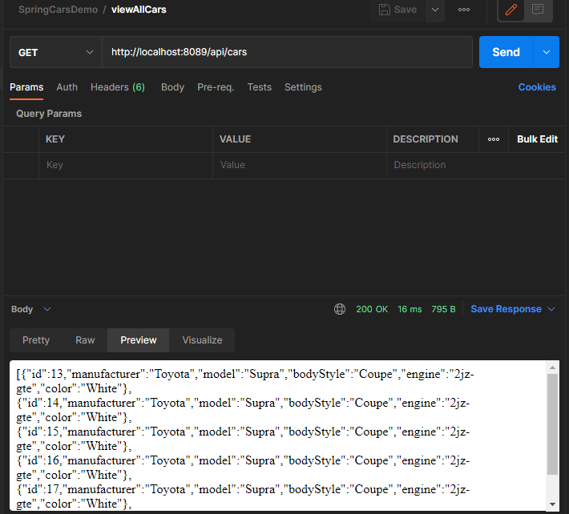
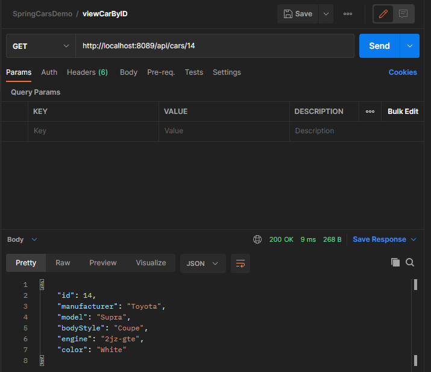
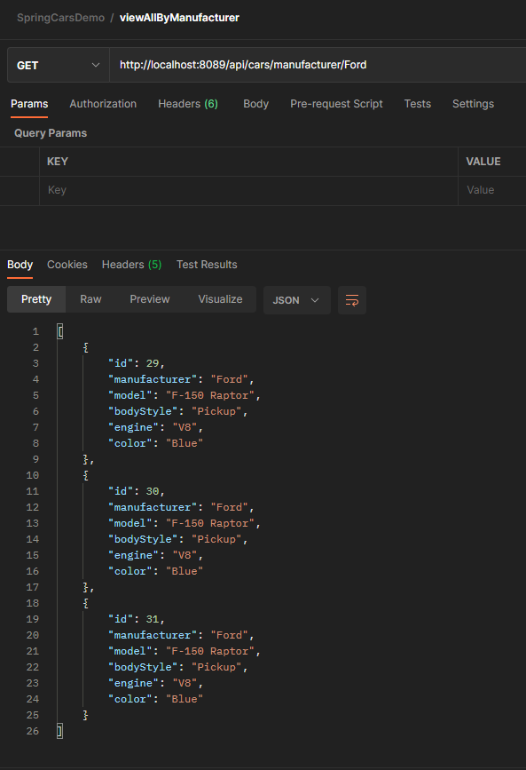
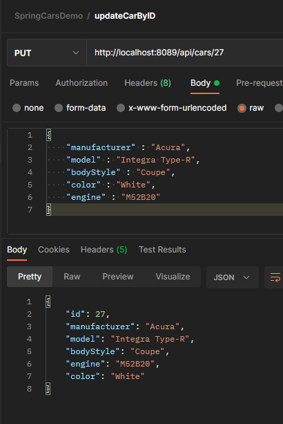
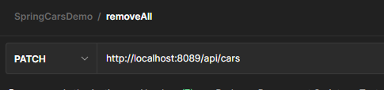
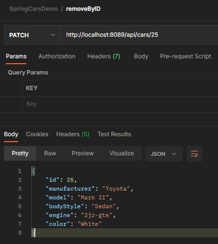

## :car: Database of cars 

    This Spring Boot application is simple example of working Web Application on Spring Framework.
    It represents a simple API to work with PostgreSQL database that storage information about cars.

---

### :robot: Technologies used in the application: 

    Spring Boot, Spring Data, Hibernate, PostgreSQL

    As client - Postman

---
### 	:computer: How to start application?

1. Make a fork from this project and clone repository.

2. Build this application using Maven. 

    
>mvn clean install

3. Make sure your PostgreSQL database is running.
4. Run .jar file.

    
>java -jar spring-boot-example-hillel-hw5.-0.0.1-SNAPSHOT.jar

or run it from IntellijIDEA

----

### When application started

#### Our request collection in Postman. :books:

There are GET, POST, PUT and PATCH requests.

Import requests collection using link
>https://www.getpostman.com/collections/37231fe0c58d2456d9f5

1. In Postman click on Import button.

2. Paste link in box and click Continue

3. Collection is ready!

#### Saving entity to database

#### View all entity's in database

#### View entity by id in database

#### View all entity's by manufacturer in database

#### Update entity by id in database

_If there is no entity with such id, EntityNotFoundException will be thrown!_

#### Delete all entity's in database

#### Delete entity by id in database

