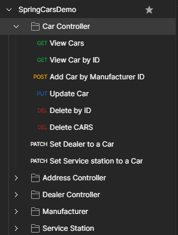

## Database of cars

    This Spring Boot application is simple example of working Web Application on Spring Framework.
    It represents a simple API to work with PostgreSQL database that storage information about cars.

---

### Technologies used in the application: 

    Spring Boot, Spring Data, Hibernate, PostgreSQL

    As client - Postman

---
### How to start application?

1. Make a fork from this project and clone repository.

2. Build this application using Maven. 

    
>mvn clean install

3. Make sure your PostgreSQL database is running.
4. Run .jar file.

    
>java -jar spring-boot-example-hillel-hw5.-0.0.1-SNAPSHOT.jar

or run it from IntellijIDEA

----

### When application started

#### Our request collection in Postman.

There are GET, POST, PUT and DELETE requests.

#### Saving entity to database

#### View all entity's in database

#### View entity by id in database

#### Update entity by id in database

#### Delete all entity's in database

#### Delete entity by id in database

